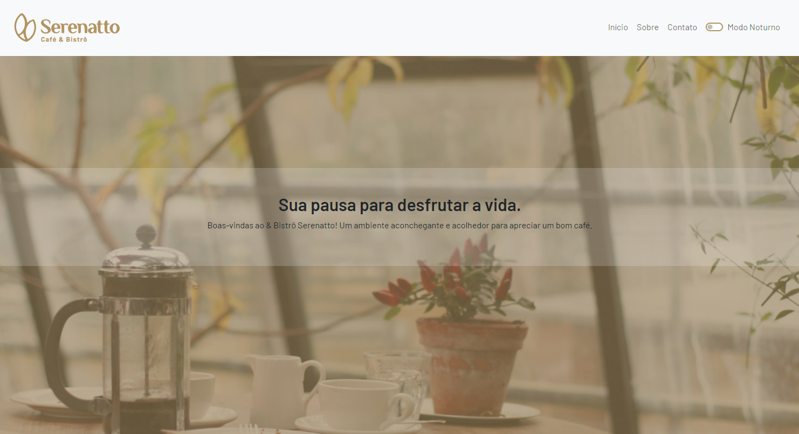
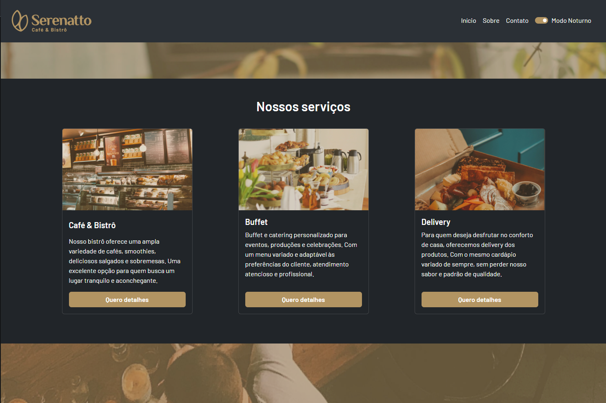
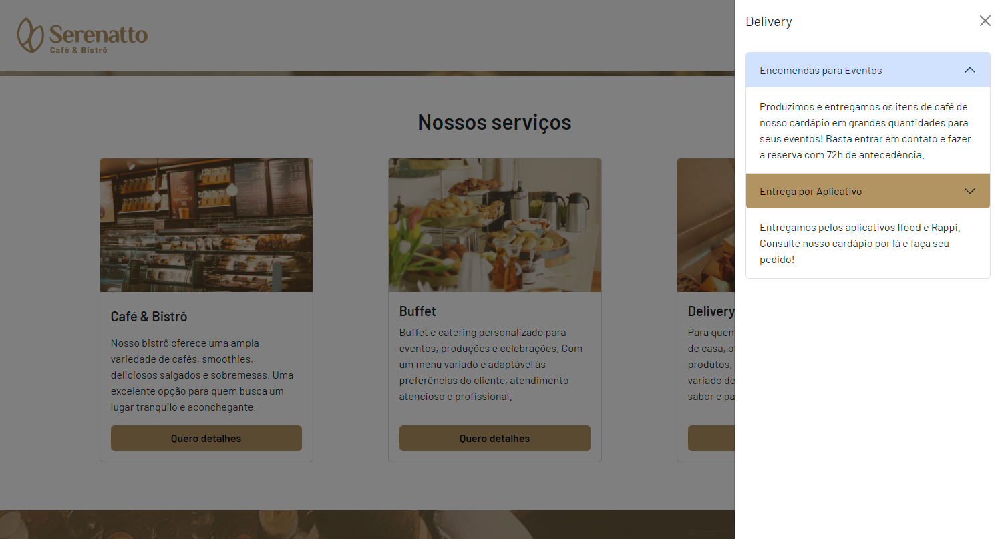
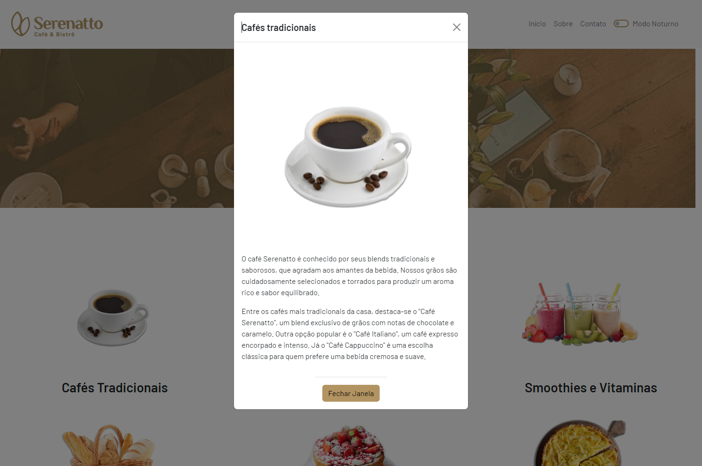
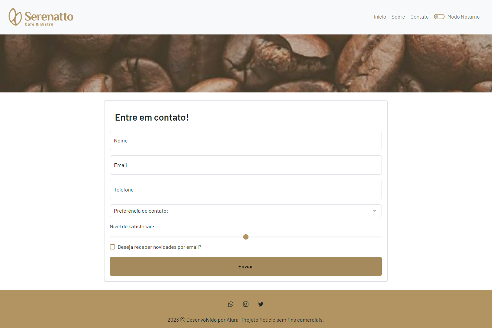

# Cafeteria Serenatto

Bem-vindo ao repositório do projeto da **Cafeteria Serenatto**! Este projeto é uma página estática desenvolvida com **Bootstrap 5** para criar uma página web para uma cafeteria fictícia. O projeto foi desenvolvido como parte do curso da Alura "[Bootstrap 5: novos recursos e práticas recomendadas de HTML, CSS e JavaScript](https://cursos.alura.com.br/course/bootstrap-5-novos-recursos-praticas-html-css-javascript)".

## Funcionalidades

- **Modo Noturno**: Permite aos usuários alternar entre o modo claro e o modo escuro.
- **Componentes OffCanvas/Accordion**: Utilizados para navegação e apresentação de informações de forma organizada e compacta.
- **Cards**: Exibem informações sobre produtos e serviços oferecidos pela cafeteria.
- **Modais**: Utilizados para exibir informações adicionais e formulários sem deixar a página principal.

## Tecnologias Utilizadas

- **HTML5**
- **CSS3**
- **Bootstrap 5**
- **JavaScript**

## Teste

O projeto pode ser visualizado e testado em:

- [Serenatto - Vercel](https://serenatto-bootstrap5.vercel.app/)

## Screenshots

